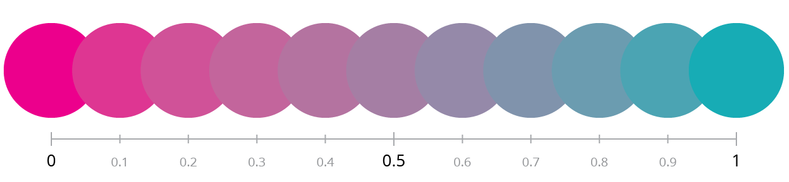
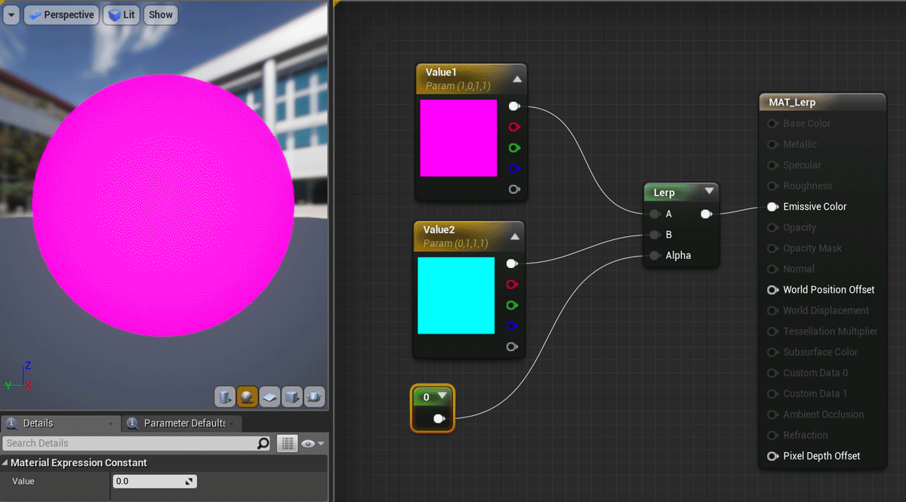
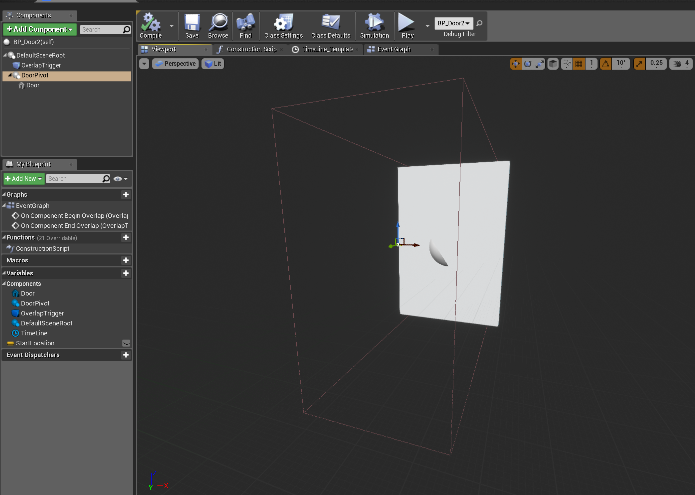
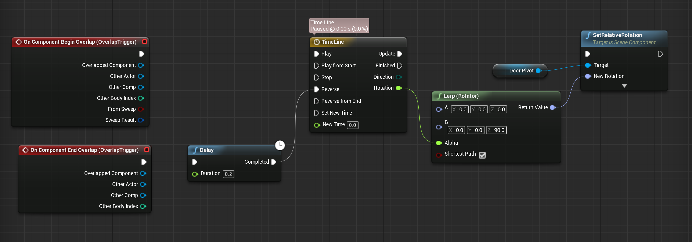
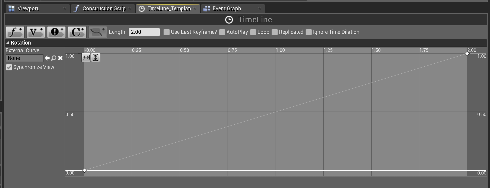

Lerps are essentially the Game Dev equivalent of blending, or tweening. Lerp is short for the mathematics term _Linear Interpolation._ It's a great way to blend, or smoothly transition, between two ... things. You can Lerp between just about anything: locations, rotations, vectors, colors, floats, etc.

A lerp is defined by two values and an alpha. The alpha is a number between 0 and 1, where 0 equals the first value, and 1 equals the second value. 0.5 would be a perfect 50/50 blend of the two.

Here's a visual example:

Let's dive in an see some Lerp examples in Unreal and Unity.

### Unreal Lerp Examples

####Lerping between colors in a material.
This is a simple example of lerping between two colors. You could set the alpha value up to be a parameter that can be set in gameplay. [Mathew Wadstein has a great video about lerps](https://youtu.be/fckeT6GyvPc) in materials, he shows examples that are more robust, including textures and normal maps.

####Opening a Hinged Door with Lerps
In this example we'll be opening a hinged door when the player enters the overlap zone. There are all sorts of Lerp nodes in UE4, but this example uses the LerpRotator node.

First create a simple Actor blueprint, I named mine BP_Door2. Then you will want to set up your door mesh independent of the rest of the door meshes. It will need to be able to move and everything else stay stationery. I just used a **Cube Static Mesh Component**. I turned off *Generate Overlap Events* on the door mesh, so it wouldn't trigger itself. There are many ways to ignore certain overlapping actors or look for a specific overlapping actor. In this demo I'm doing it quick and dirty. This article is helpful when dealing with [collision filtering](https://www.unrealengine.com/en-US/blog/collision-filtering). You will also need a **Box Collider**, this is what we'll use to tell the door to open and close based off the proximity of the player. Because the Cube's pivot point was in the center I offset it within a **Scene Component** I called "Door Pivot" so it would swing from the side, like a regular hinged door. You can create your mesh with the pivot where you want it in your 3D software, or do it the way I did.

Next set up your event graph like this. You want to trigger the door opening based on an overlap event when an actor enters the trigger volume. You could set this up so it requires a button push or something, but I went with the simplest example possible.

Double click the timeline node and create a Float Variable. Insert a keyframe at the beginning and at the end. I shortened the time to 2 seconds. Set the first keyframe value to 0 and the second to 1. In this example it's a linear graph, but you could set up the curve with some easing if you'd prefer the door doesn't open at a constant speed from start to finish. It feels a little mechanic when it's linear.

So this is what's happening: When an actor steps in the box collider, the timeline will start to play. The timeline is generating a float value over time, and sends out that value. That float output connects to the alpha input of the Lerp Rotator node. This will smoothly blend from the first rotation (0,0,0) and the second rotation (0,0,90). When the Actor leaves the trigger volume the timeline will play in reverse from whatever frame it is currently at. That's a much nicer effect than snapping to the end and playing in reverse.

<iframe width="630" height="354" src="https://www.youtube.com/embed/xjMNGR8qH_o" frameborder="0" allow="accelerometer; autoplay; encrypted-media; gyroscope; picture-in-picture" allowfullscreen></iframe>

### Unity Lerp Examples

####Lerping between colors
